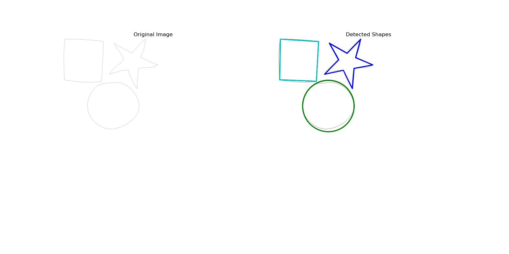
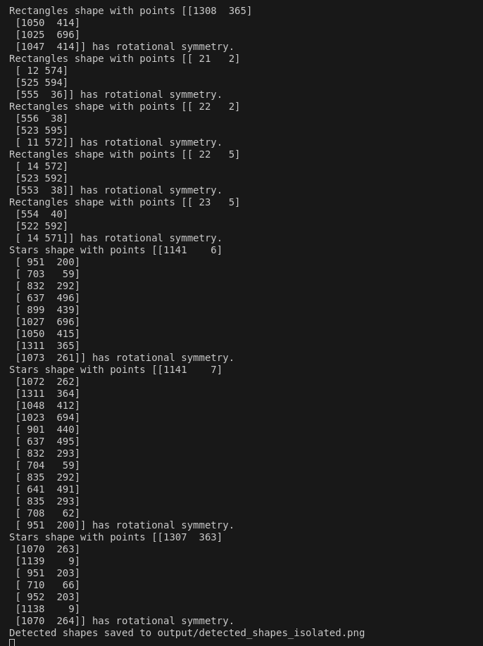

## README.md

# Shape Detection and Symmetry Analysis

This project involves detecting and analyzing various geometric shapes within 2D images generated from CSV files. The detected shapes are further analyzed for reflectional and rotational symmetry, and the results are visualized in PNG images.

## Features

- **CSV Parsing:** Read and parse CSV files containing 2D coordinate data.
- **Shape Detection:** Detects various shapes such as lines, rectangles, circles, ellipses, polygons, and stars.
- **Symmetry Analysis:** Analyzes detected shapes for reflectional and rotational symmetry.
- **Visualization:** Generates visualizations of the original image with detected shapes and highlights symmetric shapes.

## Project Structure

- `main.py`: The main script that runs the shape detection and symmetry analysis process.
- `requirements.txt`: Contains the necessary Python libraries to run the project.
- `README.md`: This documentation file.
- `/output/`: Directory where the output images will be saved.

## Installation

1. **Clone the repository:**

   ```bash
   git clone <repository-url>
   cd <repository-directory>
   ```

2. **Set up a virtual environment (optional but recommended):**

   ```bash
   python -m venv venv
   source venv/bin/activate  # On Windows use `venv\Scripts\activate`
   ```

3. **Install the required Python packages:**

   ```bash
   pip install -r requirements.txt
   ```

## Usage

1. **Prepare your CSV file:**

   - Ensure your CSV file contains paths with 2D coordinates formatted correctly.

2. **Run the script:**

   - Edit the `csv_path` in the `main.py` file to point to your CSV file.
   - Run the script using Python:

     ```bash
     python main.py
     ```

3. **View the output:**

   - The output image will be saved in the `/output/` directory with the filename format `detected_shapes_<csv_filename>.png`.

## Example Output

Given a CSV file named `isolated.csv` :

Here is an example of the output generated by the script:



Running the script will generate an image showing the detected shapes and symmetry analysis.



## Customization

- **Shape Types:**
  - Modify the `shapes_to_detect` list in the `main.py` file to add or remove shape types to detect.
- **Symmetry Analysis:**
  - The symmetry detection functions (`is_reflectionally_symmetric` and `is_rotationally_symmetric`) can be customized to adjust tolerance levels.

## Requirements

The project requires Python 3.7+ and the following libraries:

- `numpy`
- `Pillow`
- `opencv-python`
- `matplotlib`

## Contributing

Feel free to submit issues or pull requests. Contributions are welcome!

## License

This project is open-source and available under the MIT License.

---

## requirements.txt

```
numpy==1.24.3
Pillow==9.4.0
opencv-python==4.7.0.72
matplotlib==3.7.2
```

---