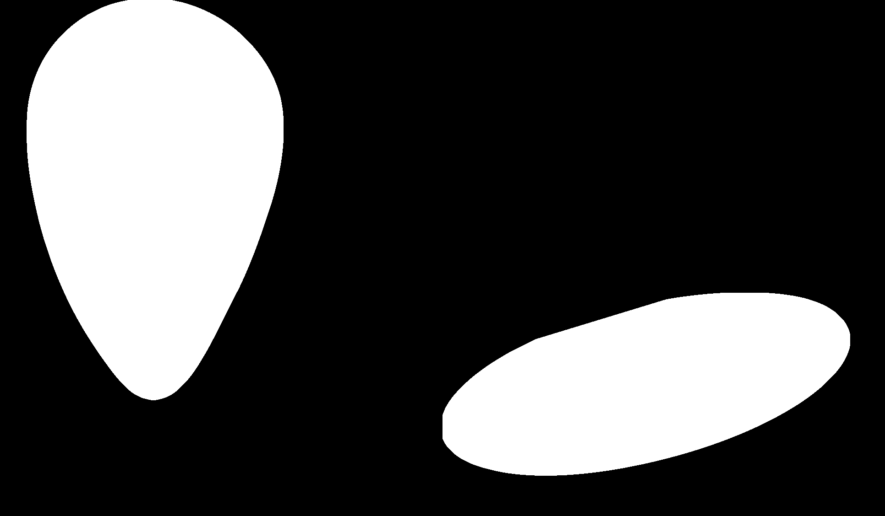

# Completing Incomplete Curves and Occlusion

We have implemented Task 3 in two ways:

This repository contains two Python scripts for image processing tasks: `maskingColors.py` and `morphology.py`. These scripts utilize OpenCV and NumPy to process and analyze images, with a focus on color segmentation and morphological operations.

## `maskingColors.py`

### Overview

`maskingColors.py` processes images to extract and segment unique colors using HSV color space. It performs the following steps:

1. **Load the Image**: Reads the image from a specified path.
2. **Extract Unique Colors**: Identifies unique non-white colors in the image and converts them from RGB to HSV.
3. **Format Color Ranges**: Formats HSV values into ranges for color segmentation.
4. **Segment by Color**: Creates masks for each color range and applies them to the image.
5. **Complete Masks**: Uses morphological operations to complete the masks and handle gaps.
6. **Concatenate Masks**: Concatenates the processed masks side by side.
7. **Save and Display**: Saves the final image and displays it.

### Dependencies

- OpenCV
- NumPy

### Usage

1. Place the script and the input image in the same directory.
2. Modify the `image_path` variable in the script to point to your image file.
3. Run the script:

    ```bash
    python maskingColors.py
    ```

4. The output will be saved in the `output` directory with the filename prefixed by `mask_`.

### Example

```python
image_path = './problems/occlusion2_rec.png'
main(image_path)
```

#

#

## `morphology.py`

### Overview

`morphology.py` processes grayscale images to detect and complete occlusions using morphological operations. It performs the following steps:

1. **Load the Image**: Reads the image as grayscale.
2. **Thresholding**: Converts the grayscale image to a binary mask.
3. **Morphological Operations**: Applies erosion, dilation, and closing operations to refine the mask.
4. **Complete Occlusions**: Fills in gaps and incomplete areas in the mask.
5. **Resize and Concatenate**: Resizes all processed images to the same height and concatenates them horizontally.
6. **Save and Display**: Saves the combined image and displays it.

### Dependencies

- OpenCV
- NumPy

### Usage

1. Place the script and the input image in the same directory.
2. Modify the `img_path` variable in the script to point to your image file.
3. Run the script:

    ```bash
    python morphology.py
    ```

4. The output will be saved in the `output` directory with the filename prefixed by `morphed_`.

### Example

```python
img_path = './problems/occlusion1_rec.png'
detect_and_complete_occlusion(img_path)
```

# 

# 

## Output

Both scripts will save processed images in the `output` directory. The `maskingColors.py` script will produce images showing segmented colors, while `morphology.py` will generate images demonstrating the effects of various morphological operations.

## Notes

- Ensure that the input images are in the correct format and accessible from the script's directory.
- You can adjust parameters such as thresholds and kernel sizes in the scripts to better suit your specific images and requirements.
- This project is developed on Linux make sure to adjust dependencies.

For any issues or contributions, please feel free to raise an issue or submit a pull request.

---
